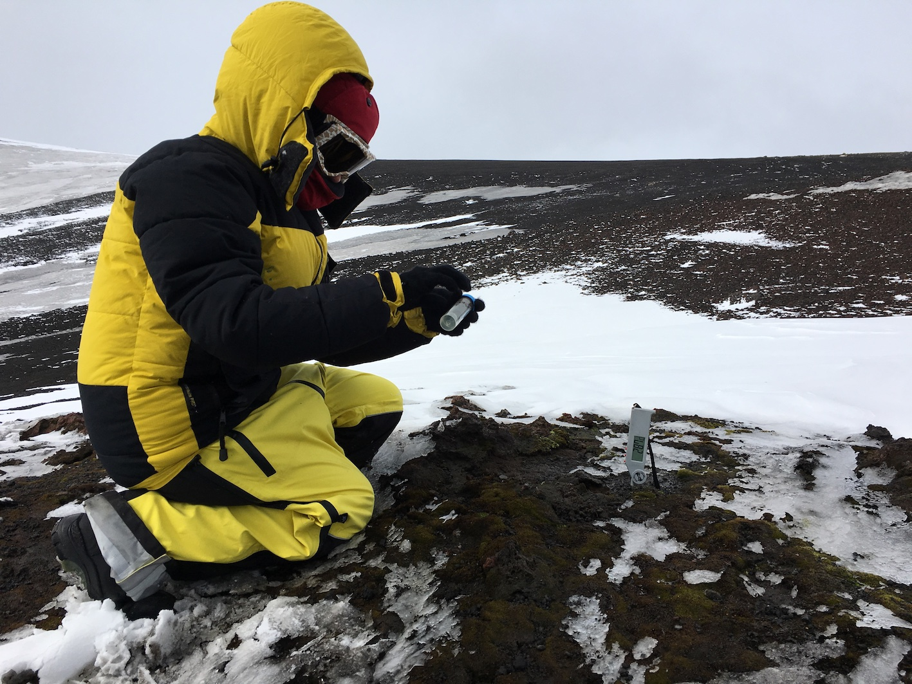

*This is the main page for the Otago eDNA Research Group*

# Announcement

[**New Zealand-Australia Environmental DNA Workshop**](https://otagoedna.github.io/eDNA_Workshop_Nov_2019/)

The [Otago eDNA Research Group](https://otagoedna.github.io/) at the [University of Otago](https://www.otago.ac.nz/) will be hosting a meeting to bring together researchers at all levels to discuss research on metabarcoding and environmental DNA. Invited speakers from across Australia and New Zealand will present their research. We will soon open the site to receive abstracts for anyone interested in sharing their research. As well, a course on new bioinformatic methods in metabarcoding will be taught on the last day. This event is scheduled for 25-28th of November, 2019.

For more information or to register, go to main conference page:

[**Environmental DNA Workshop**](https://otagoedna.github.io/eDNA_Workshop_Nov_2019/)

  

## Upcoming Events

